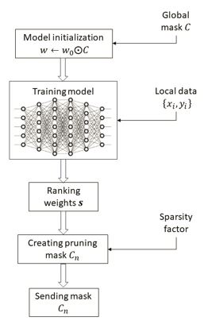
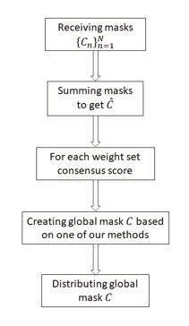

# MPFL
The Masked Pruning over Federated Learning (MPFL) Algorithm

This code is the simulation code to describe the MPFL algorithm.
The algorithm can be described in the following images.

In the future the description will contain a link to a relevant article in addition to usage tutorials.

